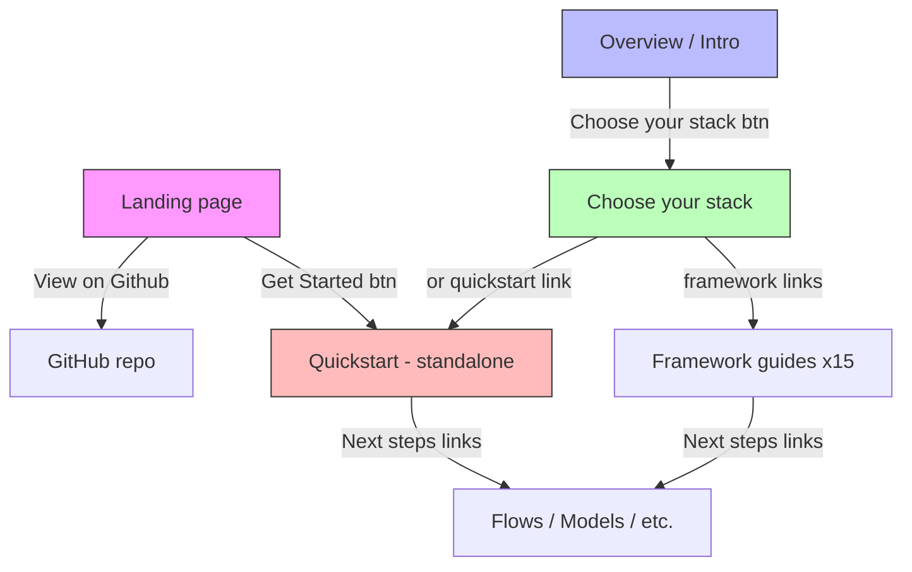
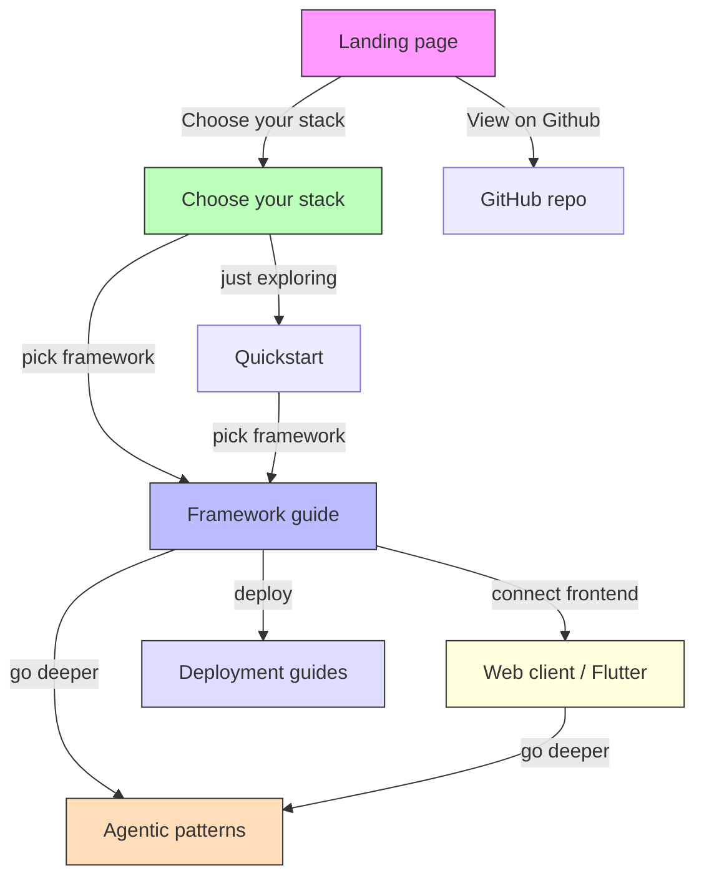

# Getting Started IA Audit

**Tagline:** *An open-source framework for building full-stack, AI-powered and agentic apps that run on any platform.*

Three claims to reinforce: **full-stack**, **agentic**, **any platform**.

---

## Current user journey



### Entry points (current)

| Surface | CTA text | Destination | Problem? |
|---------|----------|-------------|----------|
| Landing page hero | Get Started | `/docs/get-started` (Quickstart) | Sends to standalone quickstart, not framework-first path |
| Landing page bottom | Get Started | `/docs/get-started` (Quickstart) | Same |
| Overview page hero | Choose your stack | `/docs/choose-your-stack` | Good, but overview tagline is stale |
| Sidebar item 1 | Introduction | `/docs/overview` | Good |
| Sidebar item 2 | Choose your stack | `/docs/choose-your-stack` | Good |
| Sidebar item 3 | Quickstart | `/docs/get-started` | Competes with Choose your stack |

---

## What's working well

1. **"Choose your stack" hub** — Excellent concept. Framework-first onboarding respects that developers already have a stack; they want Genkit to fit into it.

2. **Language filtering in sidebar** — Framework guides are tagged with `supportedLanguages` so Go developers don't see Next.js guides. Smart and practical.

3. **Framework guides are self-contained** — Each has Prerequisites → Create project → Install → Configure → Code → Run → Test → DevUI → Next steps. A developer can go from zero to working app without reading any other page.

4. **Client pages are language-agnostic** — `web-client.mdx` and `flutter.mdx` use `isLanguageAgnostic: true` so they appear for all language selections. This correctly positions them as "frontend for any Genkit backend."

5. **Consistent recipe-generator example** — All framework guides use the same RecipeInput/Recipe flow, making it easy to compare across frameworks.

---

## Issues found

### 1. Landing page bypasses the framework-first path

The landing page hero and bottom CTA both link to `/docs/get-started` (the standalone Quickstart), not `/docs/choose-your-stack`. This means the primary marketing surface sends users to the *secondary* onboarding path.

**Impact:** Undermines the framework-first IA that Choose your stack was built for.

**Fix:** Change landing page CTAs to point to `/docs/choose-your-stack` (or the overview page, which already links there).

### 2. Overview page tagline is stale

The overview frontmatter says:
```
tagline: An open-source framework for building AI-powered apps, built and used in production by Google
```

Missing: "full-stack", "agentic", "any platform."

**Fix:** Update to match the actual tagline.

### 3. "Choose your stack" doesn't list Go framework guides

The Go section of Choose your stack only lists Quickstart + deployment:
```
- Quickstart
- Deploy with Cloud Run
- Deploy to any platform
```

But there are three Go framework guides in the sidebar: Gin, Echo, Chi. They're invisible from the Choose your stack page for Go users.

**Fix:** Add Gin, Echo, and Chi links to the Go section.

### 4. "Choose your stack" doesn't list Django

The Python section lists FastAPI and Flask but not Django, even though `django.mdx` exists in the Frameworks section.

**Fix:** Add Django to the Python section.

### 5. Sidebar Frameworks section is a flat list of 15 items

15 undifferentiated items is overwhelming. There's no visual distinction between:
- Server-side backend frameworks (Express, Gin, FastAPI...)
- Full-stack frameworks (Next.js App Router, Angular...)
- Client-only SDKs (Web client, Flutter)

**Fix options:**
- Add sub-headers/grouping within the Frameworks section (e.g., "Server frameworks", "Full-stack frameworks", "Client SDKs")
- Or split into separate sidebar sections

### 6. "Full-stack" story isn't visible in the getting started flow

The tagline says "full-stack" but the framework guides end with generic next-steps links. None of them say "Now connect a frontend" or point to the web-client/Flutter guides as a natural next step.

The web-client and Flutter pages are buried at position 14-15 of 15 in the Frameworks list.

**Fix:**
- Add a "Connect a frontend" next-step to server-side framework guides, linking to web-client or Flutter
- Promote web-client/Flutter higher in the Frameworks list or into their own "Client SDKs" group
- Add a "full-stack" callout to choose-your-stack explaining the backend + client pattern

### 7. "Agentic" isn't reinforced in the getting started flow

The landing page says "Build Powerful Agentic Apps" but the getting started flow uses a recipe generator example throughout. There's no mention of agents, tool calling, or agentic patterns until you reach the "Building AI workflows" section deeper in the sidebar.

**Fix options:**
- Add an "Agentic quickstart" or a brief callout in the choose-your-stack page that previews agentic capabilities
- Add a sentence to the recipe generator intro in each framework guide acknowledging it's a first step, with agentic patterns as a next step
- Add "Implementing agentic patterns" to the Next steps sections of framework guides

### 8. "Any platform" isn't visible early enough

The Deployment section is 7 sections deep in the sidebar. The framework guides don't mention deployment.

**Fix:**
- Add deployment as a "Next steps" link from each framework guide
- Consider adding a brief "Deploy" section to choose-your-stack

### 9. `client.mdx` is orphaned from the sidebar

The `client.mdx` page (Accessing flows from the client) still exists and is referenced from choose-your-stack and multiple framework guides, but it's not in the sidebar. Users can reach it via links but can't find it by browsing.

**Fix:** Either add it back to the sidebar (perhaps under a "Client SDKs" group in Frameworks), or merge its content into web-client/Flutter pages and redirect.

### 10. Duplicate/overlapping guidance

The `web-client.mdx` page covers the same `runFlow`/`streamFlow` client patterns that `client.mdx` does but in a more focused way. Having both creates confusion about which is canonical.

**Fix:** Make web-client.mdx the canonical client guide for web, keep client.mdx as a reference/concept page (or merge).

---

## Proposed improvements

### Priority 1: Fix the primary funnel

- [ ] **Landing page CTAs**: Change "Get Started" links from `/docs/get-started` to `/docs/choose-your-stack`
- [ ] **Overview tagline**: Update to include "full-stack", "agentic", "any platform"
- [ ] **Choose your stack — Go section**: Add Gin, Echo, Chi links
- [ ] **Choose your stack — Python section**: Add Django link

### Priority 2: Reinforce "full-stack"

- [ ] **Framework guide next-steps**: Add "Connect a frontend" step linking to web-client or Flutter
- [ ] **Sidebar Frameworks grouping**: Group into Backend / Full-stack / Client sub-sections
- [ ] **Resolve client.mdx vs web-client.mdx overlap**: Decide on one canonical path

### Priority 3: Reinforce "agentic"

- [ ] **Choose your stack**: Add brief callout about agentic capabilities as a next step
- [ ] **Framework guide next-steps**: Add "Implementing agentic patterns" link
- [ ] **Consider recipe → agentic progression**: Could the recipe example include a simple tool call to preview agentic capability?

### Priority 4: Reinforce "any platform"

- [ ] **Framework guide next-steps**: Add deployment links
- [ ] **Choose your stack**: Add deployment links per language section

---

## Proposed sidebar structure

```
Get started
  Introduction
  Choose your stack
  Quickstart
  Developer tools
  Work with Genkit in AI tools

Frameworks — Server
  Next.js App Router        [js]
  Next.js Pages Router      [js]
  Express                   [js]
  Hono                      [js]
  Fastify                   [js]
  FastAPI                   [python]
  Flask                     [python]
  Django                    [python]
  Gin                       [go]
  Echo                      [go]
  Chi                       [go]
  Shelf                     [dart]
  Angular                   [js]

Frameworks — Client
  Web client                [all languages]
  Flutter                   [all languages]

Building AI workflows
  ... (unchanged)
```

Alternatively, keep a single "Frameworks" section but add visual sub-headers.

---

## Proposed user journey (improved)


