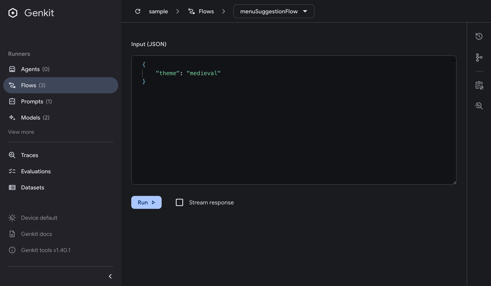
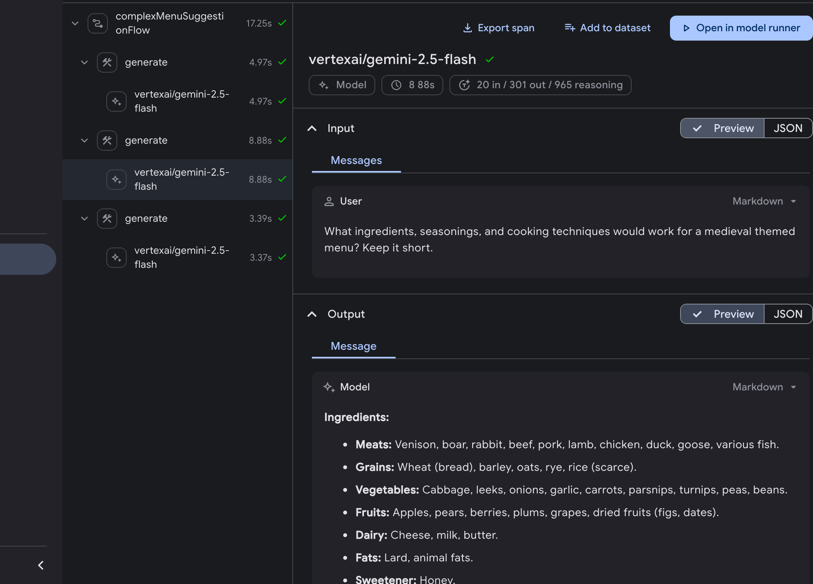
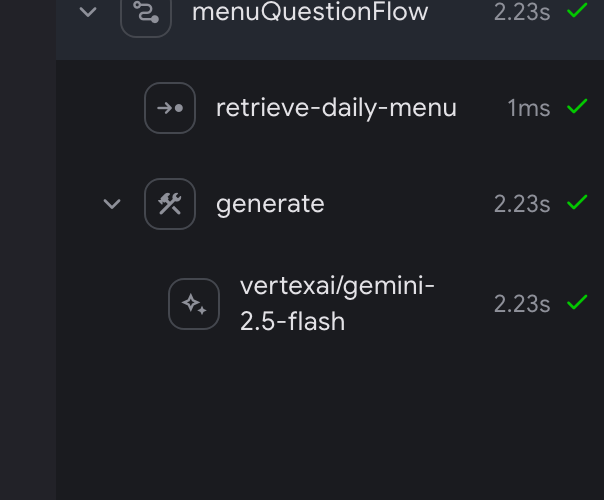

import Lang from '../../../components/Lang.astro';

AI workflows typically require more than just a model call. They need pre- and post-processing steps like retrieving context, managing session history, reformatting inputs, validating outputs, or combining multiple model responses.

A flow is a special Genkit function that wraps your AI logic to provide:

<Lang lang="js">

- **Type-safe inputs and outputs**: Define schemas using [Zod](https://zod.dev/) for static and runtime validation
- **Streaming support**: Stream partial responses or custom data
- **Developer UI integration**: Test and debug flows with visual traces
- **Easy deployment**: Deploy as HTTP endpoints to Cloud Functions for Firebase or any platform

</Lang>

<Lang lang="go">

- **Type-safe inputs and outputs**: Define schemas using Go structs for static and runtime validation
- **Streaming support**: Stream partial responses or custom data
- **Developer UI integration**: Test and debug flows with visual traces
- **Easy deployment**: Deploy as HTTP endpoints to any platform

</Lang>

<Lang lang="dart">

- **Type-safe inputs and outputs**: Define schemas using [Schematic](https://pub.dev/packages/schemantic) for static and runtime validation
- **Streaming support**: Stream partial responses or custom data
- **Developer UI integration**: Test and debug flows with visual traces
- **Easy deployment**: Deploy as HTTP endpoints to any platform

</Lang>

<Lang lang="python">

- **Type-safe inputs and outputs**: Define schemas using [Pydantic Models](https://docs.pydantic.dev/latest/concepts/models/) for static and runtime validation
- **Streaming support**: Stream partial responses or custom data
- **Developer UI integration**: Test and debug flows with visual traces
- **Easy deployment**: Deploy as HTTP endpoints to any platform

</Lang>

Flows are lightweight. They're written like regular functions with minimal abstraction.

## Defining and calling flows

In its simplest form, a flow just wraps a function. The following example wraps
a function that makes a model generation request:

<Lang lang="js">

```typescript
import { googleAI } from '@genkit-ai/google-genai';
import { genkit, z } from 'genkit';

const ai = genkit({
  plugins: [googleAI()],
});

export const menuSuggestionFlow = ai.defineFlow(
  {
    name: 'menuSuggestionFlow',
    inputSchema: z.object({ theme: z.string() }),
    outputSchema: z.object({ menuItem: z.string() }),
  },
  async ({ theme }) => {
    const { text } = await ai.generate({
      model: googleAI.model('gemini-flash-latest'),
      prompt: `Invent a menu item for a ${theme} themed restaurant.`,
    });
    return { menuItem: text };
  },
);
```

</Lang>

<Lang lang="go">

```go
package main

import (
	"context"
	"fmt"

	"github.com/firebase/genkit/go/ai"
	"github.com/firebase/genkit/go/genkit"
	"github.com/firebase/genkit/go/plugins/googlegenai"
)

func main() {
	ctx := context.Background()

	g := genkit.Init(ctx,
		genkit.WithPlugins(&googlegenai.GoogleAI{}),
	)

	type MenuSuggestionInput struct {
		Theme string `json:"theme"`
	}

	type MenuSuggestionOutput struct {
		MenuItem string `json:"menuItem"`
	}

	genkit.DefineFlow(g, "menuSuggestionFlow",
		func(ctx context.Context, input MenuSuggestionInput) (MenuSuggestionOutput, error) {
			resp, err := genkit.Generate(ctx, g,
				ai.WithPrompt("Invent a menu item for a %s themed restaurant.", input.Theme),
			)
			if err != nil {
				return MenuSuggestionOutput{}, fmt.Errorf("could not invent a menu item: %w", err)
			}

			return MenuSuggestionOutput{MenuItem: resp.Text()}, nil
		})
}
```

`genkit.Init` returns a `*genkit.Genkit`, and that is the value every other
Genkit call takes. When your flows live in other files, pass it in:
`func defineMenuFlows(g *genkit.Genkit)`.

</Lang>

<Lang lang="dart">

```dart
import 'package:genkit/genkit.dart';
import 'package:genkit_google_genai/genkit_google_genai.dart';
import 'package:schemantic/schemantic.dart';

part 'main.g.dart';

@Schema()
abstract class $MenuSuggestionInput {
  String get theme;
}

@Schema()
abstract class $MenuSuggestionOutput {
  String get menuItem;
}

void main() {
  final ai = Genkit(plugins: [googleAI()]);

  final menuSuggestionFlow = ai.defineFlow(
    name: 'menuSuggestionFlow',
    inputSchema: MenuSuggestionInput.$schema,
    outputSchema: MenuSuggestionOutput.$schema,
    fn: (input, _) async {
      final response = await ai.generate(
        model: googleAI.gemini('gemini-flash-latest'),
        prompt: 'Invent a menu item for a ${input.theme} themed restaurant.',
      );
      return MenuSuggestionOutput(menuItem: response.text);
    },
  );
}
```

</Lang>

<Lang lang="python">

```python
from genkit import Genkit
from genkit_google_genai import GoogleAI
from pydantic import BaseModel, Field

ai = Genkit(
    plugins=[GoogleAI()],
    model='googleai/gemini-flash-latest',
)

class MenuSuggestionInput(BaseModel):
    theme: str = Field(description='Restaurant theme')

class MenuSuggestionOutput(BaseModel):
    menu_item: str = Field(description='Generated menu item')

@ai.flow()
async def menu_suggestion_flow(input: MenuSuggestionInput) -> MenuSuggestionOutput:
    """Generate a menu item suggestion based on a theme."""
    response = await ai.generate(
      prompt=f'Invent a menu item for a {input.theme} themed restaurant.',
    )
    return MenuSuggestionOutput(menu_item=response.text)
```

The flow name defaults to the function name and the description defaults to the
docstring (though both can optionally be overridden using `name` and `description`
parameters in `@ai.flow()`); input and output schemas come from the type hints.
Choose a clear function name and write a descriptive docstring.

</Lang>

Just by wrapping your generate calls like this, you add some functionality:
doing so lets you run the flow from the Genkit CLI and from the developer UI,
and is a requirement for several of Genkit's features, including deployment and
observability (later sections discuss these topics).

### Input and output schemas

One of the most important advantages Genkit flows have over directly calling a
model API is type safety of both inputs and outputs. When defining flows, you
can define schemas for them.

<Lang lang="js">

You can define schemas using Zod, in much the same way as you define the
output schema of a `generate()` call; however, unlike with `generate()`, you can
also specify an input schema.

While it's not mandatory to wrap your input and output schemas in `z.object()`, it's considered best practice for these reasons:

- **Better developer experience**: Wrapping schemas in objects provides a better experience in the Developer UI by giving you labeled input fields.
- **Future-proof API design**: Object-based schemas allow for easy extensibility in the future. You can add new fields to your input or output schemas without breaking existing clients, which is a core principle of robust API design.

All examples in this documentation use object-based schemas to follow these best practices.

</Lang>

<Lang lang="go">

You can define schemas using Go structs with JSON tags. While you can use primitive types directly as input and output parameters, it's considered best practice to use struct-based schemas for these reasons:

- **Better developer experience**: Struct-based schemas provide a better experience in the Developer UI by giving you labeled input fields.
- **Future-proof API design**: Struct-based schemas allow for easy extensibility in the future. You can add new fields to your input or output schemas without breaking existing clients, which is a core principle of robust API design.

All examples in this documentation use struct-based schemas to follow these best practices.

</Lang>

<Lang lang="dart">

You can define schemas using the `@Schema` annotation from the `schemantic` package. This generates Dart classes with JSON serialization and schema definitions.

- **Better developer experience**: Schematic-based schemas provide a better experience in the Developer UI by giving you labeled input fields.
- **Future-proof API design**: Schematic-based schemas allow for easy extensibility in the future.

All examples in this documentation use Schematic-based schemas to follow these best practices.

</Lang>

<Lang lang="python">

You can define schemas using Pydantic models. While you can use primitive types directly as input and output parameters, it's considered best practice to use Pydantic model-based schemas for these reasons:

- **Better developer experience**: Model-based schemas provide a better experience in the Developer UI by giving you labeled input fields.
- **Future-proof API design**: Model-based schemas allow for easy extensibility in the future. You can add new fields to your input or output schemas without breaking existing clients, which is a core principle of robust API design.

</Lang>

Here's a refinement of the last example, which defines a flow that takes a
string as input and outputs an object:

<Lang lang="js">

```typescript
import { z } from 'genkit';

const MenuItemSchema = z.object({
  dishname: z.string(),
  description: z.string(),
});

export const menuSuggestionFlowWithSchema = ai.defineFlow(
  {
    name: 'menuSuggestionFlow',
    inputSchema: z.object({ theme: z.string() }),
    outputSchema: MenuItemSchema,
  },
  async ({ theme }) => {
    const { output } = await ai.generate({
      model: googleAI.model('gemini-flash-latest'),
      prompt: `Invent a menu item for a ${theme} themed restaurant.`,
      output: { schema: MenuItemSchema },
    });
    if (output == null) {
      throw new Error("Response doesn't satisfy schema.");
    }
    return output;
  },
);
```

</Lang>

<Lang lang="go">

```go
type MenuSuggestionInput struct {
	Theme string `json:"theme"`
}

type MenuItem struct {
	Name        string `json:"name"`
	Description string `json:"description"`
}

menuSuggestionFlow := genkit.DefineFlow(g, "menuSuggestionFlow",
	func(ctx context.Context, input MenuSuggestionInput) (MenuItem, error) {
		item, resp, err := genkit.GenerateData[MenuItem](ctx, g,
			ai.WithPrompt("Invent a menu item for a %s themed restaurant.", input.Theme),
		)
		if err != nil {
			return MenuItem{}, fmt.Errorf("could not invent a menu item: %w", err)
		}
		// GenerateData answers with a nil value and no error when the
		// response carried no text to parse, as an interrupted one does.
		if item == nil {
			return MenuItem{}, status.Errorf(status.ErrInternal,
				"the model returned no menu item (%s)", resp.FinishReason)
		}

		return *item, nil
	})
```

`genkit.GenerateData[MenuItem]` returns a `*MenuItem`, so a caller has three
things to check in order: the error, then whether the value is nil, and only
then the value itself. A nil value with no error means the response carried
something other than text, such as a tool request or an interrupt, so inspect
`resp.FinishReason`, `resp.Interrupts()`, or `resp.ToolRequests()` to decide
what to do. The
[basic-structured sample](https://github.com/genkit-ai/genkit/tree/main/go/samples/basic-structured)
works through typed output, including the nested and streaming cases.

`status.Errorf` comes from `github.com/firebase/genkit/go/core/status`. It
classifies the failure as `INTERNAL` so the HTTP boundary can pick a response
code without re-reading the message; see
[Handling errors in flows](#handling-errors-in-flows) below.

</Lang>

<Lang lang="dart">

```dart
@Schema()
abstract class $MenuSuggestionInput {
  String get theme;
}

@Schema()
abstract class $MenuItem {
  String get dishname;
  String get description;
}

final menuSuggestionFlow = ai.defineFlow(
  name: 'menuSuggestionFlow',
  inputSchema: MenuSuggestionInput.$schema,
  outputSchema: MenuItem.$schema,
  fn: (input, _) async {
    final response = await ai.generate(
      model: googleAI.gemini('gemini-flash-latest'),
      prompt: 'Invent a menu item for a ${input.theme} themed restaurant.',
      outputSchema: MenuItem.$schema,
    );
    if (response.output == null) {
      throw Exception("Response doesn't satisfy schema.");
    }
    return response.output!;
  },
);
```

</Lang>

<Lang lang="python">

```python
from pydantic import BaseModel, Field

class MenuSuggestionInput(BaseModel):
    theme: str = Field(description='Restaurant theme')

class MenuItemSchema(BaseModel):
    dishname: str = Field(description='Name of the dish')
    description: str = Field(description='Description of the dish')

@ai.flow()
async def menu_suggestion_flow(input: MenuSuggestionInput) -> MenuItemSchema:
    """Generate a menu item suggestion based on a theme."""
    response = await ai.generate(
      prompt=f'Invent a menu item for a {input.theme} themed restaurant.',
      output_schema=MenuItemSchema,
    )
    return response.output
```

</Lang>

Note that the schema of a flow does not necessarily have to line up with the
schema of the model generation calls within the flow (in fact, a flow might not even
contain model calls). Here's a variation of the example that uses the structured output to format a simple string, which the flow returns.

<Lang lang="js">

```typescript
export const menuSuggestionFlowMarkdown = ai.defineFlow(
  {
    name: 'menuSuggestionFlow',
    inputSchema: z.object({ theme: z.string() }),
    outputSchema: z.object({ formattedMenuItem: z.string() }),
  },
  async ({ theme }) => {
    const { output } = await ai.generate({
      model: googleAI.model('gemini-flash-latest'),
      prompt: `Invent a menu item for a ${theme} themed restaurant.`,
      output: { schema: MenuItemSchema },
    });
    if (output == null) {
      throw new Error("Response doesn't satisfy schema.");
    }
    return {
      formattedMenuItem: `**${output.dishname}**: ${output.description}`,
    };
  },
);
```

</Lang>

<Lang lang="go">

Note how we pass `MenuItem` as a type parameter; this is the equivalent of passing the
`WithOutputType()` option and getting a value of that type in response.

```go
type MenuSuggestionInput struct {
	Theme string `json:"theme"`
}

type MenuItem struct {
	Name        string `json:"name"`
	Description string `json:"description"`
}

type FormattedMenuOutput struct {
	FormattedMenuItem string `json:"formattedMenuItem"`
}

menuSuggestionMarkdownFlow := genkit.DefineFlow(g, "menuSuggestionMarkdownFlow",
	func(ctx context.Context, input MenuSuggestionInput) (FormattedMenuOutput, error) {
		item, resp, err := genkit.GenerateData[MenuItem](ctx, g,
			ai.WithPrompt("Invent a menu item for a %s themed restaurant.", input.Theme),
		)
		if err != nil {
			return FormattedMenuOutput{}, fmt.Errorf("could not invent a menu item: %w", err)
		}
		if item == nil {
			return FormattedMenuOutput{}, status.Errorf(status.ErrInternal,
				"the model returned no menu item (%s)", resp.FinishReason)
		}

		return FormattedMenuOutput{
			FormattedMenuItem: fmt.Sprintf("**%s**: %s", item.Name, item.Description),
		}, nil
	})
```

</Lang>

<Lang lang="dart">

```dart
@Schema()
abstract class $MenuSuggestionInput {
  String get theme;
}

@Schema()
abstract class $MenuItem {
  String get dishname;
  String get description;
}

@Schema()
abstract class $FormattedMenuOutput {
  String get formattedMenuItem;
}

final menuSuggestionFlow = ai.defineFlow(
  name: 'menuSuggestionFlow',
  inputSchema: MenuSuggestionInput.$schema,
  outputSchema: FormattedMenuOutput.$schema,
  fn: (input, _) async {
    final response = await ai.generate(
      model: googleAI.gemini('gemini-flash-latest'),
      prompt: 'Invent a menu item for a ${input.theme} themed restaurant.',
      outputSchema: MenuItem.$schema,
    );
    if (response.output == null) {
      throw Exception("Response doesn't satisfy schema.");
    }
    final output = response.output!;
    return FormattedMenuOutput(
      formattedMenuItem: '**${output.dishname}**: ${output.description}',
    );
  },
);
```

</Lang>

<Lang lang="python">

```python
from pydantic import BaseModel, Field

class MenuSuggestionInput(BaseModel):
    theme: str = Field(description='Restaurant theme')

class MenuItemSchema(BaseModel):
    dishname: str = Field(description='Name of the dish')
    description: str = Field(description='Description of the dish')

class FormattedMenuOutput(BaseModel):
    formatted_menu_item: str = Field(description='Formatted menu item in markdown')

@ai.flow()
async def menu_suggestion_flow(input: MenuSuggestionInput) -> FormattedMenuOutput:
    """Generate a menu item suggestion based on a theme."""
    response = await ai.generate(
      prompt=f'Invent a menu item for a {input.theme} themed restaurant.',
      output_schema=MenuItemSchema,
    )
    output: MenuItemSchema = response.output
    return FormattedMenuOutput(
        formatted_menu_item=f'**{output.dishname}**: {output.description}'
    )
```

</Lang>

### Calling flows

Once you've defined a flow, you can call it from your code:

<Lang lang="js">

```typescript
const { text } = await menuSuggestionFlow({ theme: 'bistro' });
```

</Lang>

<Lang lang="go">

```go
output, err := menuSuggestionFlow.Run(context.Background(), MenuSuggestionInput{Theme: "bistro"})
```

</Lang>

<Lang lang="dart">

```dart
final response = await menuSuggestionFlow(
  MenuSuggestionInput(theme: 'bistro'),
);
```

</Lang>

<Lang lang="python">

```python
response = await menu_suggestion_flow(MenuSuggestionInput(theme='bistro'))
```

</Lang>

The argument to the flow must conform to the input schema.

If you defined an output schema, the flow response will conform to it. For
example, if you set the output schema to `MenuItemSchema`, the flow output will
contain its properties:

<Lang lang="js">

```typescript
const { dishname, description } = await menuSuggestionFlowWithSchema({
  theme: 'bistro',
});
```

</Lang>

<Lang lang="go">

```go
item, err := menuSuggestionFlow.Run(context.Background(), MenuSuggestionInput{Theme: "bistro"})
if err != nil {
	log.Fatal(err)
}

log.Println(item.Name)
log.Println(item.Description)
```

</Lang>

<Lang lang="dart">

```dart
final output = await menuSuggestionFlow(
  MenuSuggestionInput(theme: 'bistro'),
);
print(output.dishname);
print(output.description);
```

</Lang>

## Streaming flows

Flows support streaming using an interface similar to the model generation streaming
interface. Streaming is useful when your flow generates a large amount of
output, because you can present the output to the user as it's being generated,
which improves the perceived responsiveness of your app. As a familiar example,
chat-based LLM interfaces often stream their responses to the user as they are
generated.

<Lang lang="js">

:::tip[Durable streaming]
For flows that run for a long time or where network reliability is a concern, you can use [durable streaming](/docs/durable-streaming). This allows the client to reconnect to a stream and replay the content.
:::

</Lang>

<Lang lang="go">

:::tip[Durable streaming]
For flows that run for a long time or where network reliability is a concern, you can use [durable streaming](/docs/durable-streaming). This allows the client to reconnect to a stream and replay the content. Note that durable streaming for Go is currently experimental.
:::

</Lang>

Here's an example of a flow that supports streaming:

<Lang lang="js">

```typescript
export const menuSuggestionStreamingFlow = ai.defineFlow(
  {
    name: 'menuSuggestionFlow',
    inputSchema: z.object({ theme: z.string() }),
    streamSchema: z.string(),
    outputSchema: z.object({ theme: z.string(), menuItem: z.string() }),
  },
  async ({ theme }, { sendChunk }) => {
    const { stream, response } = ai.generateStream({
      model: googleAI.model('gemini-flash-latest'),
      prompt: `Invent a menu item for a ${theme} themed restaurant.`,
    });

    for await (const chunk of stream) {
      // Here, you could process the chunk in some way before sending it to
      // the output stream via sendChunk(). In this example, we output
      // the text of the chunk, unmodified.
      sendChunk(chunk.text);
    }

    const { text: menuItem } = await response;

    return {
      theme,
      menuItem,
    };
  },
);
```

- The `streamSchema` option specifies the type of values your flow streams.
  This does not necessarily need to be the same type as the `outputSchema`,
  which is the type of the flow's complete output.
- The second parameter to your flow definition is called `sideChannel`. It
  provides features such as request context and the `sendChunk` callback.
  The `sendChunk` callback takes a single parameter, of
  the type specified by `streamSchema`. Whenever data becomes available within
  your flow, send the data to the output stream by calling this function.

In the above example, the values streamed by the flow are directly coupled to
the values streamed by the model generation call inside the flow. Although this is
often the case, it doesn't have to be: you can output values to the stream using
the callback as often as is useful for your flow.

</Lang>

<Lang lang="go">

A streaming flow is defined with `genkit.DefineStreamingFlow`, whose function
takes a `sendChunk` callback alongside the input. What that function looks like
depends on what the flow does with the model's output. The
[basic sample](https://github.com/genkit-ai/genkit/tree/main/go/samples/basic)
shows the forwarding shape, and the
[basic-structured sample](https://github.com/genkit-ai/genkit/tree/main/go/samples/basic-structured)
has both shapes side by side.

The snippets in this section assume these imports:

```go
import (
	"context"
	"fmt"

	"github.com/firebase/genkit/go/ai"
	"github.com/firebase/genkit/go/core"
	"github.com/firebase/genkit/go/core/status"
	"github.com/firebase/genkit/go/genkit"
)
```

`core.StreamCallback[T]` is a type alias for `func(context.Context, T) error`,
so writing the function type out longhand is the same declaration.
`ai.ModelStreamCallback` is that alias with `T` set to `*ai.ModelResponseChunk`.

#### Forwarding the model's chunks

When the flow passes the model's output straight through, `ai.WithStreaming` is
the whole job: hand it the flow's own `sendChunk` and the model's chunks reach
the caller untouched, while `genkit.Generate` still returns the finished
response.

```go
type MenuSuggestionInput struct {
	Theme string `json:"theme"`
}

menuSuggestionFlow := genkit.DefineStreamingFlow(g, "menuSuggestionFlow",
	func(ctx context.Context, input MenuSuggestionInput, sendChunk ai.ModelStreamCallback) (string, error) {
		resp, err := genkit.Generate(ctx, g,
			ai.WithPrompt("Invent a menu item for a %s themed restaurant.", input.Theme),
			ai.WithStreaming(sendChunk),
		)
		if err != nil {
			return "", fmt.Errorf("could not invent a menu item: %w", err)
		}

		return resp.Text(), nil
	})
```

Declaring the callback as `ai.ModelStreamCallback` is what lets `sendChunk` be
passed straight through: the flow streams the model's chunks unchanged, so it
streams the model's chunk type. To stream something else, wrap the callback and
declare the type you want:

```go
type Menu struct {
	Theme string     `json:"theme"`
	Items []MenuItem `json:"items"`
}

type MenuItem struct {
	Name        string `json:"name"`
	Description string `json:"description"`
}

menuSuggestionFlow := genkit.DefineStreamingFlow(g, "menuSuggestionFlow",
	func(ctx context.Context, input MenuSuggestionInput, sendChunk core.StreamCallback[string]) (Menu, error) {
		item, resp, err := genkit.GenerateData[MenuItem](ctx, g,
			ai.WithPrompt("Invent a menu item for a %s themed restaurant.", input.Theme),
			ai.WithStreaming(func(ctx context.Context, chunk *ai.ModelResponseChunk) error {
				return sendChunk(ctx, chunk.Text())
			}),
		)
		if err != nil {
			return Menu{}, fmt.Errorf("could not invent a menu item: %w", err)
		}
		if item == nil {
			return Menu{}, status.Errorf(status.ErrInternal,
				"the model returned no menu item (%s)", resp.FinishReason)
		}

		return Menu{
			Theme: input.Theme,
			Items: []MenuItem{*item},
		}, nil
	})
```

The `string` in `core.StreamCallback[string]` is the type the flow streams. It
does not have to be the same type as the flow's complete output (`Menu` here).
`chunk.Text()` is the text that just arrived rather than the message so far, so
forwarding it gives a client something to append.

`genkit.DefineFlow` returns `*core.Flow[In, Out, struct{}]` and
`genkit.DefineStreamingFlow` returns `*core.Flow[In, Out, Stream]`, so a flow
that lives in its own file is declared with its concrete type:

```go
func newMenuSuggestionFlow(g *genkit.Genkit) *core.Flow[MenuSuggestionInput, Menu, string] {
	return genkit.DefineStreamingFlow(g, "menuSuggestionFlow",
		func(ctx context.Context, input MenuSuggestionInput, sendChunk core.StreamCallback[string]) (Menu, error) {
			// ...
			return Menu{}, nil
		})
}
```

`genkit.DefineTool` returns `*ai.ToolAction[In, Out]` on the same principle.

#### Acting on the chunks

When the flow has to inspect, filter, or accumulate what arrives, range over
`genkit.GenerateStream`, which hands you each chunk and then the final response
in one loop:

```go
menuSuggestionFlow := genkit.DefineStreamingFlow(g, "menuSuggestionFlow",
	func(ctx context.Context, input MenuSuggestionInput, sendChunk core.StreamCallback[string]) (string, error) {
		for result, err := range genkit.GenerateStream(ctx, g,
			ai.WithPrompt("Invent a menu item for a %s themed restaurant.", input.Theme),
		) {
			if err != nil {
				return "", fmt.Errorf("could not invent a menu item: %w", err)
			}
			if result.Done {
				return result.Response.Text(), nil
			}
			// Forward only the text, dropping the tool traffic a multi-turn
			// run also carries.
			if text := result.Chunk.Text(); text != "" {
				sendChunk(ctx, text)
			}
		}

		return "", status.Errorf(status.ErrInternal, "the stream ended without a final result")
	})
```

For typed output, `genkit.GenerateDataStream[T]` does the same with the schema
inferred from `T`:

```go
menuSuggestionFlow := genkit.DefineStreamingFlow(g, "menuSuggestionFlow",
	func(ctx context.Context, input MenuSuggestionInput, sendChunk core.StreamCallback[MenuItem]) (MenuItem, error) {
		for result, err := range genkit.GenerateDataStream[MenuItem](ctx, g,
			ai.WithPrompt("Invent a menu item for a %s themed restaurant.", input.Theme),
		) {
			if err != nil {
				return MenuItem{}, fmt.Errorf("could not invent a menu item: %w", err)
			}
			if result.Done {
				// result.Output is strongly typed as MenuItem.
				return result.Output, nil
			}
			// result.Chunk is the whole MenuItem parsed so far.
			sendChunk(ctx, result.Chunk)
		}

		return MenuItem{}, status.Errorf(status.ErrInternal, "the stream ended without a final result")
	})
```

With the default JSON format each chunk replaces the previous one rather than
adding to it: the whole value is reparsed from everything received so far, so
fields fill in as the model writes them. Guard on a field you care about rather
than assuming every chunk carries something new. Use the pointer form,
`GenerateDataStream[*MenuItem]`, only when you want chunks that have not parsed
into anything yet dropped instead of delivered as a zero value;
[Generating content](/docs/models#streaming-structured-output) has the full
rationale.

The values a flow streams are often coupled to the values the generation call
inside it streams, but they do not have to be. You can call `sendChunk` as often
as is useful, with whatever your flow has to report.

#### Using channel-based streaming (experimental)

:::caution[Experimental API]
The channel-based streaming API is in preview and may change in any minor
release. It lives in `github.com/firebase/genkit/go/genkit/exp` and requires
`genkit.WithExperimental()` at initialization.
:::

For a more idiomatic Go approach, you can use the experimental channel-based
streaming API. Instead of a callback, your flow function receives a channel
to which it writes stream chunks:

```go
import (
	"context"
	"fmt"

	"github.com/firebase/genkit/go/ai"
	"github.com/firebase/genkit/go/core/status"
	"github.com/firebase/genkit/go/genkit"
	genkitx "github.com/firebase/genkit/go/genkit/exp"
)

jokeFlow := genkitx.DefineStreamingFlow(g, "jokeFlow",
	func(ctx context.Context, topic string, streamCh chan<- string) (string, error) {
		for result, err := range genkit.GenerateStream(ctx, g,
			ai.WithPrompt("Tell me a joke about %s.", topic),
		) {
			if err != nil {
				return "", fmt.Errorf("could not generate joke: %w", err)
			}
			if result.Done {
				return result.Response.Text(), nil
			}
			select {
			case streamCh <- result.Chunk.Text():
			case <-ctx.Done():
				return "", ctx.Err()
			}
		}

		return "", status.Errorf(status.ErrInternal, "the stream ended without a final result")
	})
```

The channel-based API:

- Passes a send-only channel (`chan<- string`) to your function instead of a callback
- The channel is managed by the framework and closed automatically after your function returns
- Your function should NOT close the channel
- Use a `select` statement with `ctx.Done()` to handle cancellation gracefully

The returned flow works identically to callback-based flows and can be run
with either `Run()` or `Stream()`.

</Lang>

<Lang lang="dart">

```dart
@Schema()
abstract class $MenuSuggestionInput {
  String get theme;
}

@Schema()
abstract class $MenuOutput {
  String get theme;
  String get menuItem;
}

final menuSuggestionFlow = ai.defineFlow(
  name: 'menuSuggestionFlow',
  inputSchema: MenuSuggestionInput.$schema,
  outputSchema: MenuOutput.$schema,
  streamSchema: .string(),
  fn: (input, ctx) async {
    final stream = ai.generateStream(
      model: googleAI.gemini('gemini-flash-latest'),
      prompt: 'Invent a menu item for a ${input.theme} themed restaurant.',
    );

    await for (final chunk in stream) {
      if (ctx.streamingRequested) {
        ctx.sendChunk(chunk.text);
      }
    }

    final response = await stream.onResult;
    return MenuOutput(
      theme: input.theme,
      menuItem: response.text,
    );
  },
);
```

</Lang>

<Lang lang="python">

```python
from pydantic import BaseModel, Field
from genkit import ActionRunContext

class MenuSuggestionInput(BaseModel):
    theme: str = Field(description='Restaurant theme')

class MenuOutput(BaseModel):
    theme: str = Field(description='Restaurant theme')
    menu_item: str = Field(description='Generated menu item')

@ai.flow()
async def menu_suggestion_flow(input: MenuSuggestionInput, ctx: ActionRunContext) -> MenuOutput:
    """Generate a menu item suggestion based on a theme."""
    stream_response = ai.generate_stream(
      prompt=f'Invent a menu item for a {input.theme} themed restaurant.',
    )

    async for chunk in stream_response.stream:
        ctx.send_chunk(chunk.text)

    return MenuOutput(
        theme=input.theme,
        menu_item=(await stream_response.response).text
    )
```

The second parameter to your flow definition is called "side channel". It
provides features such as request context and the `send_chunk` callback.
The `send_chunk` callback takes a single parameter. Whenever data becomes
available within your flow, send the data to the output stream by calling
this function.

In the above example, the values streamed by the flow are directly coupled to
the values streamed by the `generate_stream()` call inside the flow. Although this is
often the case, it doesn't have to be: you can output values to the stream using
the callback as often as is useful for your flow.

</Lang>

### Calling streaming flows

<Lang lang="js">

Streaming flows are also callable, but they immediately return a response object
rather than a promise:

```typescript
const response = menuSuggestionStreamingFlow.stream({ theme: 'Danube' });
```

The response object has a stream property, which you can use to iterate over the
streaming output of the flow as it's generated:

```typescript
for await (const chunk of response.stream) {
  console.log('chunk', chunk);
}
```

You can also get the complete output of the flow, as you can with a
non-streaming flow:

```typescript
const output = await response.output;
```

Note that the streaming output of a flow might not be the same type as the
complete output; the streaming output conforms to `streamSchema`, whereas the
complete output conforms to `outputSchema`.

</Lang>

<Lang lang="go">

Streaming flows can be run like non-streaming flows with
`menuSuggestionFlow.Run(ctx, MenuSuggestionInput{Theme: "bistro"})` or they can be streamed:

```go
for result, err := range menuSuggestionFlow.Stream(context.Background(), MenuSuggestionInput{Theme: "bistro"}) {
	if err != nil {
		log.Fatalf("Stream error: %v", err)
	}
	if result.Done {
		log.Printf("Menu with %s theme:\n", result.Output.Theme)
		for _, item := range result.Output.Items {
			log.Printf(" - %s: %s", item.Name, item.Description)
		}
	} else {
		log.Println("Stream chunk:", result.Stream)
	}
}
```

`Stream` returns an iterator, so the error arrives as the loop's second value.
`result.Stream` carries a chunk while `result.Done` is false, and `result.Output`
carries the flow's complete output once it is true.

</Lang>

<Lang lang="dart">

Streaming flows are also callable, but they immediately return a specialized response object (`FlowStreamResponse`) rather than a future. This object contains a stream property which you can iterate over.

```dart
final response = menuSuggestionFlow.stream(
  MenuSuggestionInput(theme: 'bistro'),
);

await for (final chunk in response.stream) {
  print('chunk: $chunk');
}
```

You can also get the complete output of the flow. The final output is available as a future on the response object.

```dart
final output = await response.output;
```

</Lang>

<Lang lang="python">

Streaming flows are also callable, but they immediately return a response object
rather than a promise. Flow's `stream` method returns the stream async iterable,
which you can iterate over the streaming output of the flow as it's generated.

```python
stream_response = menu_suggestion_flow.stream(MenuSuggestionInput(theme='bistro'))
async for chunk in stream_response.stream:
    print(chunk)
```

You can also get the complete output of the flow, as you can with a
non-streaming flow. The final response is a future that you can `await` on.

```python
print(await stream_response.response)
```

Note that the streaming output of a flow might not be the same type as the
complete output.

</Lang>

<Lang lang="go">

## Handling errors in flows

A flow returns an ordinary Go `error`. Classify it once, where its meaning is
known, using a sentinel from the `core/status` package. `status.PublicErrorf`
marks a message as safe to show a client; `status.Errorf` keeps it internal.

```go
if strings.TrimSpace(input.Dish) == "" {
	return "", status.PublicErrorf(status.ErrInvalidArgument, "dish must not be empty")
}
```

Add context as the error travels with `fmt.Errorf` and `%w`. Wrapping does not
reclassify, so the status and the public message chosen at the source survive to
the HTTP boundary. `%v` flattens the error to text and loses both.

```go
recipe, err := lookupRecipe(input.Dish)
if err != nil {
	return "", fmt.Errorf("could not look up the recipe: %w", err)
}
```

Branch with `errors.Is` against a sentinel, never on message text:

```go
if errors.Is(err, ErrRecipeNotFound) {
	// Recover: improvise a recipe instead of failing the request.
}
```

At the HTTP boundary the status picks the response code, and only a message
written with `status.PublicErrorf` reaches the client. Anything else is replaced
with a generic string and logged in full server-side. Setting `GENKIT_ENV=dev`
returns the real message instead, so what you see while developing is not the
production contract. The status code is the same either way. See
[Error types](/docs/error-types/) for the sentinels, subtypes, and the redaction
rules. The
[basic-errors sample](https://github.com/genkit-ai/genkit/tree/main/go/samples/basic-errors)
walks one flow that produces classified errors, one that recovers from them, and
one that fails unclassified so you can watch the boundary redact it.

### Errors on a streaming request

Asking for a stream changes where a failure lands. The server has already
answered `200 OK` with `Content-Type: text/event-stream` before the flow runs, so
the failure arrives in the body as a final event rather than on the status line:

```text
data: {"error":{"status":"INVALID_ARGUMENT","message":"dish must not be empty"}}
```

The frame carries exactly two fields, `status` and `message`, and is terminated
by a blank line like every other event. Chunks sent before the failure are still
delivered, so a client must read to the end of the stream rather than key on the
HTTP status.

</Lang>

## Running flows from the command line

You can run flows from the command line using the Genkit CLI tool:

<Lang lang="js go">

```bash
genkit flow:run menuSuggestionFlow '{"theme": "French"}' -- <command to start your app>
```

</Lang>

<Lang lang="python">

```bash
genkit flow:run menu_suggestion_flow '{"theme": "French"}' -- uv run main.py
```

</Lang>

For streaming flows, you can print the streaming output to the console by adding
the `-s` flag:

<Lang lang="js go dart">

```bash
genkit flow:run menuSuggestionFlow '{"theme": "French"}' -s -- <command to start your app>
```

</Lang>

<Lang lang="python">

```bash
genkit flow:run menu_suggestion_flow '{"theme": "French"}' -s -- uv run main.py
```

</Lang>

Running a flow from the command line is useful for testing a flow, or for
running flows that perform tasks needed on an ad hoc basis&mdash;for example, to
run a flow that ingests a document into your vector database.

## Debugging flows

One of the advantages of encapsulating AI logic within a flow is that you can
test and debug the flow independently from your app using the Genkit developer
UI.

<Lang lang="go">

The developer UI relies on the Go app continuing to run, even if the logic has
completed. If you are just getting started and Genkit is not part of a broader
app, end `main()` by starting a server instead of returning:

```go
log.Fatal(server.Start(ctx, "127.0.0.1:3400", http.NewServeMux()))
```

That keeps the process alive, serves whatever you mount on the mux, and still
exits on Ctrl-C. A bare `select {}` also keeps the process alive, but it ignores
`SIGINT`, so you have to kill the process to stop it.

</Lang>

To start the developer UI, run the following command from your project
directory:

<Lang lang="js">

```bash
genkit start -- tsx --watch src/your-code.ts
```

</Lang>

<Lang lang="go">

```bash
genkit start -- go run .
```

</Lang>

<Lang lang="python">

```bash
genkit start -- uv run app.py
```

Update `uv run app.py` to match the way you normally run your app.

</Lang>

From the **Run** tab of developer UI, you can run any of the flows defined in
your project:

<Lang lang="js">



After you've run a flow, you can inspect a trace of the flow invocation by
either clicking **View trace** or looking on the **Inspect** tab.

In the trace viewer, you can see details about the execution of the entire flow,
as well as details for each of the individual steps within the flow. For
example, consider the following flow, which contains several generation
requests:

```typescript
const PrixFixeMenuSchema = z.object({
  starter: z.string(),
  soup: z.string(),
  main: z.string(),
  dessert: z.string(),
});

export const complexMenuSuggestionFlow = ai.defineFlow(
  {
    name: 'complexMenuSuggestionFlow',
    inputSchema: z.object({ theme: z.string() }),
    outputSchema: PrixFixeMenuSchema,
  },
  async ({ theme }): Promise<z.infer<typeof PrixFixeMenuSchema>> => {
    const chat = ai.chat({ model: googleAI.model('gemini-flash-latest') });
    await chat.send('What makes a good prix fixe menu?');
    await chat.send(
      'What are some ingredients, seasonings, and cooking techniques that ' +
        `would work for a ${theme} themed menu?`,
    );
    const { output } = await chat.send({
      prompt:
        `Based on our discussion, invent a prix fixe menu for a ${theme} ` +
        'themed restaurant.',
      output: {
        schema: PrixFixeMenuSchema,
      },
    });
    if (!output) {
      throw new Error('No data generated.');
    }
    return output;
  },
);
```

When you run this flow, the trace viewer shows you details about each generation
request including its output:



### Flow steps

In the last example, you saw that each `generate()` call showed up as a separate
step in the trace viewer. Each of Genkit's fundamental actions show up as
separate steps of a flow:

- `generate()`
- `Chat.send()`
- `embed()`
- `index()`
- `retrieve()`

If you want to include code other than the above in your traces, you can do so
by wrapping the code in a `run()` call. You might do this for calls to
third-party libraries that are not Genkit-aware, or for any critical section of
code.

For example, here's a flow with two steps: the first step retrieves a menu using
some unspecified method, and the second step includes the menu as context for a
`generate()` call.

```ts
export const menuQuestionFlow = ai.defineFlow(
  {
    name: 'menuQuestionFlow',
    inputSchema: z.object({ question: z.string() }),
    outputSchema: z.object({ answer: z.string() }),
  },
  async ({ question }): Promise<{ answer: string }> => {
    const menu = await ai.run(
      'retrieve-daily-menu',
      async (): Promise<string> => {
        // Retrieve today's menu. (This could be a database access or simply
        // fetching the menu from your website.)

        // ...

        return menu;
      },
    );
    const { text } = await ai.generate({
      model: googleAI.model('gemini-flash-latest'),
      system: "Help the user answer questions about today's menu.",
      prompt: question,
      docs: [{ content: [{ text: menu }] }],
    });
    return { answer: text };
  },
);
```

Because the retrieval step is wrapped in a `run()` call, it's included as a step
in the trace viewer:



</Lang>

<Lang lang="go">


After you've run a flow, you can inspect a trace of the flow invocation by
either clicking **View trace** or looking at the **Inspect** tab.

### Flow steps

Each of Genkit's fundamental actions show up as separate steps in the trace viewer:

- `genkit.Generate()`
- `genkit.Embed()`
- `genkit.Retrieve()`

If you want to include code other than the above in your traces, you can do so
by wrapping the code in a `genkit.RunWithContext()` call. You might do this for
calls to third-party libraries that are not Genkit-aware, or for any critical
section of code.

For example, here's a flow with two steps: the first step retrieves a menu using
some unspecified method, and the second step includes the menu as context for a
`genkit.Generate()` call.

```go
type MenuQuestionInput struct {
	Question string `json:"question"`
}

type MenuQuestionOutput struct {
	Answer string `json:"answer"`
}

menuQuestionFlow := genkit.DefineFlow(g, "menuQuestionFlow",
	func(ctx context.Context, input MenuQuestionInput) (MenuQuestionOutput, error) {
		menu, err := genkit.RunWithContext(ctx, "retrieve-daily-menu",
			func(ctx context.Context) (string, error) {
				// Retrieve today's menu. (This could be a database access or
				// simply fetching the menu from your website.)
				return fetchMenu(ctx)
			})
		if err != nil {
			return MenuQuestionOutput{}, fmt.Errorf("could not retrieve the menu: %w", err)
		}

		resp, err := genkit.Generate(ctx, g,
			ai.WithPrompt(input.Question),
			ai.WithSystem("Help the user answer questions about today's menu."),
			ai.WithTextDocs(menu),
		)
		if err != nil {
			return MenuQuestionOutput{}, fmt.Errorf("could not answer the question: %w", err)
		}

		return MenuQuestionOutput{Answer: resp.Text()}, nil
	})
```

`RunWithContext` hands the step its own context, so anything the step starts with
it, an HTTP client or a database call, nests under the step in the trace instead
of beside it under the flow. Use `genkit.Run` instead when the step is pure work
that traces nothing of its own; it takes a `func() (Out, error)` with no context.

Because the retrieval step is wrapped in a `genkit.RunWithContext()` call, it's
included as a step in the trace viewer:


</Lang>

<Lang lang="python">

After you've run a flow, you can inspect a trace of the flow invocation by
either clicking **View trace** or looking on the **Inspect** tab.

In the trace viewer, you can see details about the execution of the entire flow,
as well as details for each of the individual steps within the flow.

### Flow steps

Each of Genkit's fundamental actions show up as separate steps in the trace viewer:

- `ai.generate()`
- `ai.embed()`

If you want to include other code in your traces (for example retrieval against
your own vector store, or calls to third-party libraries), wrap it in an
`ai.run()` call.

For example, here's a flow with two steps: the first step retrieves a menu using
some unspecified method, and the second step includes the menu in a `generate()`
call.

```python
from genkit import Genkit
from genkit_google_genai import GoogleAI
from pydantic import BaseModel, Field

ai = Genkit(
    plugins=[GoogleAI()],
    model='googleai/gemini-flash-latest',
)

class MenuQuestionInput(BaseModel):
    question: str = Field(description="User's question about today's menu")

class MenuQuestionOutput(BaseModel):
    answer: str = Field(description="Answer to the user's question")

@ai.flow()
async def menu_question_flow(input: MenuQuestionInput) -> MenuQuestionOutput:
    """Answer questions about today's menu."""
    async def retrieve_daily_menu() -> str:
        # Retrieve today's menu. (This could be a database access or simply
        # fetching the menu from your website.)
        #
        # ...
        #
        return "Soup: tomato bisque\nMain: roast chicken\nDessert: panna cotta"

    menu = await ai.run(name='retrieve-daily-menu', fn=retrieve_daily_menu)

    response = await ai.generate(
        system="Help the user answer questions about today's menu.",
        prompt=f"Today's menu:\n{menu}\n\nQuestion:\n{input.question}",
    )
    return MenuQuestionOutput(answer=response.text)
```

Because the retrieval step is wrapped in an `ai.run()` call, it's included as a
step in the trace viewer:


</Lang>

## Deploying flows

You can deploy your flows directly as web API endpoints, ready for you to call
from your app clients. Deployment is discussed in detail on several other pages,
but this section gives brief overviews of your deployment options.

<Lang lang="js">

### Cloud Functions for Firebase

To deploy flows with Cloud Functions for Firebase, use the `onCallGenkit`
feature of `firebase-functions/https`. `onCallGenkit` wraps your flow in a
callable function. You may set an auth policy and configure App Check.

```typescript
import { hasClaim, onCallGenkit } from 'firebase-functions/https';
import { defineSecret } from 'firebase-functions/params';

const apiKey = defineSecret('GOOGLE_AI_API_KEY');

const menuSuggestionFlow = ai.defineFlow(
  {
    name: 'menuSuggestionFlow',
    inputSchema: z.object({ theme: z.string() }),
    outputSchema: z.object({ menuItem: z.string() }),
  },
  async ({ theme }) => {
    // ...
    return { menuItem: 'Generated menu item would go here' };
  },
);

export const menuSuggestion = onCallGenkit(
  {
    secrets: [apiKey],
    authPolicy: hasClaim('email_verified'),
  },
  menuSuggestionFlow,
);
```

### Express.js

To deploy flows using any Node.js hosting platform, such as Cloud Run, define
your flows using `defineFlow()` and then call `startFlowServer()`:

```typescript
import { startFlowServer } from '@genkit-ai/express';

export const menuSuggestionFlow = ai.defineFlow(
  {
    name: 'menuSuggestionFlow',
    inputSchema: z.object({ theme: z.string() }),
    outputSchema: z.object({ result: z.string() }),
  },
  async ({ theme }) => {
    // ...
  },
);

startFlowServer({
  flows: [menuSuggestionFlow],
});
```

By default, `startFlowServer` will serve all the flows defined in your codebase
as HTTP endpoints (for example, `http://localhost:3400/menuSuggestionFlow`).

If needed, you can customize the flows server to serve a specific list of flows,
as shown below. You can also specify a custom port (it will use the PORT
environment variable if set) or specify CORS settings.

```typescript
export const flowA = ai.defineFlow(
  {
    name: 'flowA',
    inputSchema: z.object({ subject: z.string() }),
    outputSchema: z.object({ response: z.string() }),
  },
  async ({ subject }) => {
    // ...
    return { response: 'Generated response would go here' };
  },
);

export const flowB = ai.defineFlow(
  {
    name: 'flowB',
    inputSchema: z.object({ subject: z.string() }),
    outputSchema: z.object({ response: z.string() }),
  },
  async ({ subject }) => {
    // ...
    return { response: 'Generated response would go here' };
  },
);

startFlowServer({
  flows: [flowB],
  port: 4567,
  cors: {
    origin: '*',
  },
});
```

</Lang>

<Lang lang="go">

### `net/http` server

To deploy a flow using any Go hosting platform, such as Cloud Run, define
your flow using `genkit.DefineFlow()` and start a `net/http` server with the
provided flow handler using `genkit.Handler()`:

```go
package main

import (
	"context"
	"fmt"
	"log"
	"net/http"
	"os"

	"github.com/firebase/genkit/go/ai"
	"github.com/firebase/genkit/go/core/status"
	"github.com/firebase/genkit/go/genkit"
	"github.com/firebase/genkit/go/plugins/googlegenai"
	"github.com/firebase/genkit/go/plugins/server"
)

type MenuSuggestionInput struct {
	Theme string `json:"theme"`
}

type MenuItem struct {
	Name        string `json:"name"`
	Description string `json:"description"`
}

func main() {
	ctx := context.Background()

	g := genkit.Init(ctx, genkit.WithPlugins(&googlegenai.GoogleAI{}))

	menuSuggestionFlow := genkit.DefineFlow(g, "menuSuggestionFlow",
		func(ctx context.Context, input MenuSuggestionInput) (MenuItem, error) {
			item, resp, err := genkit.GenerateData[MenuItem](ctx, g,
				ai.WithPrompt("Invent a menu item for a %s themed restaurant.", input.Theme),
			)
			if err != nil {
				return MenuItem{}, fmt.Errorf("could not invent a menu item: %w", err)
			}
			if item == nil {
				return MenuItem{}, status.Errorf(status.ErrInternal,
					"the model returned no menu item (%s)", resp.FinishReason)
			}
			return *item, nil
		})

	mux := http.NewServeMux()
	mux.HandleFunc("POST /menuSuggestionFlow", genkit.Handler(menuSuggestionFlow))

	// Bind 0.0.0.0 and honor $PORT: Cloud Run and most other hosts inject the
	// port and health-check the container from outside, so a loopback bind
	// fails to start.
	port := os.Getenv("PORT")
	if port == "" {
		port = "3400"
	}
	log.Fatal(server.Start(ctx, "0.0.0.0:"+port, mux))
}
```

`server.Start()` is optional, but it is more than a local-development
convenience: it traps `SIGINT` and `SIGTERM`, stops accepting new connections,
and calls `http.Server.Shutdown` with a fixed 5-second budget to drain
in-flight requests. That budget is not configurable. If a single flow can
legitimately run longer than five seconds, which a multi-turn model call often
does, construct your own `http.Server` and drain it on your own schedule.

Bind `127.0.0.1` only when you mean local-only, such as while running under the
Developer UI.

To serve all the flows defined in your codebase, you can use
`genkit.ListFlows()`:

```go
mux := http.NewServeMux()
for _, flow := range genkit.ListFlows(g) {
    mux.HandleFunc("POST /"+flow.Name(), genkit.Handler(flow))
}
log.Fatal(server.Start(ctx, "0.0.0.0:"+port, mux))
```

This mounts every registered flow, including any you did not mean to expose.
Mount flows one at a time, or filter the list, when the process defines internal
flows as well as public ones.

### Handling flow errors centrally

`genkit.Handler` writes the error itself. When your framework already has one
place that turns an error into a response, use `genkit.HandlerFunc` instead:

```go
func HandlerFunc(a api.Action, opts ...HandlerOption) func(http.ResponseWriter, *http.Request) error
```

It takes the action, not the `*genkit.Genkit` (`api.Action` is the interface a
flow, tool, or prompt satisfies), accepts the same `HandlerOption`s as
`genkit.Handler`, and panics if an option fails to apply.
The returned function runs the flow and hands you its error, so your own
middleware decides the status and the body:

```go
func withErrors(h func(http.ResponseWriter, *http.Request) error) http.Handler {
	return http.HandlerFunc(func(w http.ResponseWriter, r *http.Request) {
		err := h(w, r)
		if err == nil {
			return
		}
		log.Printf("flow %s failed: %v", r.URL.Path, err)
		// PublicMessage substitutes a generic string unless the error was
		// built with status.PublicErrorf, so internal detail stays server-side.
		msg, _ := status.PublicMessage(err)
		http.Error(w, msg, status.Of(err).HTTPCode())
	})
}

mux.Handle("POST /menuSuggestionFlow", withErrors(genkit.HandlerFunc(menuSuggestionFlow)))
```

### Protecting deployed flows

`genkit.Handler` performs no authentication. It decodes the request, applies the
`HandlerOption`s you passed, and runs the flow. A flow you mount is open to
anyone who can reach the port, so put your own middleware in front of it. The
fragments below add `strings` and `github.com/firebase/genkit/go/core` to the
imports of the program above:

```go
func requireBearerToken(next http.Handler) http.Handler {
	return http.HandlerFunc(func(w http.ResponseWriter, r *http.Request) {
		token := strings.TrimPrefix(r.Header.Get("Authorization"), "Bearer ")
		if _, err := verifyToken(r.Context(), token); err != nil {
			http.Error(w, "unauthorized", http.StatusUnauthorized)
			return
		}
		next.ServeHTTP(w, r)
	})
}
```

`verifyToken` is yours to write against whatever issues your tokens; Genkit does
not supply one.

To let the flow itself see who is calling, pass a context provider. It runs per
request and its result becomes the flow's action context:

```go
func callerFromRequest(ctx context.Context, req core.RequestData) (core.ActionContext, error) {
	// req.Headers keys are lowercased.
	uid, err := verifyToken(ctx, strings.TrimPrefix(req.Headers["authorization"], "Bearer "))
	if err != nil {
		return nil, err
	}
	return core.ActionContext{"uid": uid}, nil
}

mux.Handle("POST /menuSuggestionFlow", requireBearerToken(
	genkit.Handler(menuSuggestionFlow, genkit.WithContextProviders(callerFromRequest)),
))
```

Inside the flow, read it back with `core.FromContext`:

```go
uid, _ := core.FromContext(ctx)["uid"].(string)
```

Verify the credential in the middleware, not only in the context provider, so an
unauthenticated request never reaches the flow.

### Concurrency, timeouts, and lifetime

A `*genkit.Genkit`, and the flow, tool, and prompt values the `Define*`
functions return, are safe for concurrent use by many goroutines; the registry
behind them is mutex-guarded. Create one instance in `main()`, define every
flow, tool, and schema during startup before the server begins serving, and
share that instance across all request handlers. Constructing a `*genkit.Genkit`
per request re-runs plugin initialization and is never correct.

Genkit has no timeout option. Bound a flow or a generate call with the standard
library:

```go
ctx, cancel := context.WithTimeout(r.Context(), 30*time.Second)
defer cancel()
```

The deadline propagates to the model client and to any tool the turn calls. An
expired deadline surfaces as `DEADLINE_EXCEEDED`, which retry middleware treats
as retryable; an explicit cancellation surfaces as `CANCELLED` and stops
retries.

[Concurrency, cancellation, and lifecycle](/docs/concurrency) has the rest:
parallel tool fan-out, abandoning a stream, and flushing telemetry on shutdown.

### Other server frameworks

You can also use other server frameworks to deploy your flows. For
example, you can use [Gin](https://gin-gonic.com/) with just a few lines:

```go
router := gin.Default()
for _, flow := range genkit.ListFlows(g) {
    router.POST("/"+flow.Name(), func(c *gin.Context) {
        genkit.Handler(flow)(c.Writer, c.Request)
    })
}
log.Fatal(router.Run(":3400"))
```

</Lang>

<Lang lang="python">

### FastAPI

Install `genkit-fastapi`, then mount the flow with `serve_flow` so requests use
the Genkit HTTP envelope (`{"data": ...}`):

```python
import os

from fastapi import FastAPI
from pydantic import BaseModel, Field

from genkit import Genkit
from genkit_fastapi import serve_flow
from genkit_google_genai import GoogleAI

ai = Genkit(
    plugins=[GoogleAI()],
    model='googleai/gemini-flash-latest',
)

app = FastAPI()

class MenuSuggestionInput(BaseModel):
    theme: str = Field(description='Restaurant theme')

class MenuSuggestionOutput(BaseModel):
    menu_item: str = Field(description='Generated menu item')

@ai.flow()
async def menu_suggestion_flow(input: MenuSuggestionInput) -> MenuSuggestionOutput:
    """Generate a menu item suggestion based on a theme."""
    response = await ai.generate(
        prompt=f'Invent a menu item for a {input.theme} themed restaurant.',
    )
    return MenuSuggestionOutput(menu_item=response.text)

app.include_router(serve_flow(menu_suggestion_flow))

if __name__ == '__main__':
    import uvicorn

    uvicorn.run(
        'main:app',
        host='0.0.0.0',
        port=int(os.environ.get('PORT', 3400)),
    )
```

To attach per-request context (auth, tenancy, and so on), pass a FastAPI dependency as `context_dependency`. Its return value must be a dict; Genkit exposes that dict on the flow as `ctx.context`:

```python
from fastapi import Header
from genkit import ActionRunContext

async def user_context(authorization: str = Header(...)) -> dict[str, object]:
    return {'uid': authorization.removeprefix('Bearer ').strip()}

@ai.flow()
async def menu_suggestion_flow(
    input: MenuSuggestionInput,
    ctx: ActionRunContext,
) -> MenuSuggestionOutput:
    """Generate a menu item suggestion based on a theme."""
    uid = (ctx.context or {}).get('uid')
    ...

app.include_router(
    serve_flow(menu_suggestion_flow, context_dependency=user_context),
)
```

For production, run your app with a production ASGI server (for example, Uvicorn with Gunicorn workers):

```bash
gunicorn -k uvicorn.workers.UvicornWorker -b 0.0.0.0:3400 main:app
```

</Lang>

### Calling deployed flows

Once your flow is deployed, you can call it with a POST request:

```bash
curl -X POST "http://localhost:3400/menuSuggestionFlow" \
  -H "Content-Type: application/json" -d '{"data": {"theme": "banana"}}'
```

For streaming responses, you can add the `Accept: text/event-stream` header:

```bash
curl -X POST "http://localhost:3400/menuSuggestionFlow" \
  -H "Content-Type: application/json" \
  -H "Accept: text/event-stream" \
  -d '{"data": {"theme": "banana"}}'
```

### Learn more about deployment

For detailed deployment instructions and platform-specific guides, see:

- [Deploy with Cloud Run](/docs/deployment/cloud-run)

<Lang lang="js">

You can also use the Genkit web client library to call flows from web applications. See [Accessing flows from the client](/docs/client) for detailed examples of using the `runFlow()` and `streamFlow()` functions.

- [Deploy with Firebase](/docs/deployment/firebase)
- [Authorization and integrity](/docs/deployment/authorization)
- [Deploy flows to any Node.js platform](/docs/deployment/any-platform)

</Lang>

<Lang lang="python">

- [FastAPI tutorial](/docs/backend-frameworks/fastapi) (`serve_flow` / `serve_agent`)
- [Deploy to any platform](/docs/deployment/any-platform)

</Lang>
