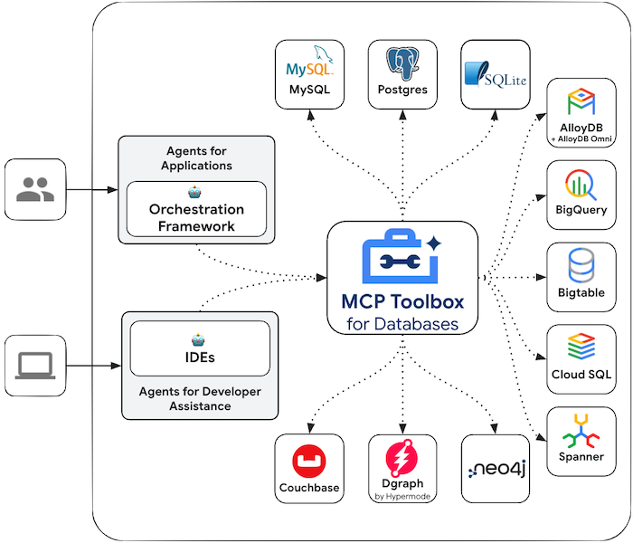

import LanguageSelector from '../../../../components/LanguageSelector.astro';
import CopyMarkdownButton from '../../../../components/CopyMarkdownButton.astro';
import LanguageContent from '../../../../components/LanguageContent.astro';

<div style="display: flex; justify-content: space-between; align-items: center; gap: 1rem; margin: 1rem 0 1rem 0;">
  <LanguageSelector supportedLanguages="js" />
  <CopyMarkdownButton />
</div>

<LanguageContent lang="js">
[MCP Toolbox for Databases](https://github.com/googleapis/genai-toolbox) is an open source MCP server for databases. It was designed with enterprise-grade and production-quality in mind. It enables you to develop tools easier, faster, and more securely by handling the complexities such as connection pooling, authentication, and more.

Toolbox Tools can be seamlessly integrated with Genkit applications. For more information on [getting started](https://googleapis.github.io/genai-toolbox/getting-started/) or [configuring](https://googleapis.github.io/genai-toolbox/getting-started/configure/) Toolbox, see the [documentation](https://googleapis.github.io/genai-toolbox/getting-started/introduction/).



## Features

- **Enterprise-grade database connectivity**: Production-ready connection pooling and management
- **Built-in authentication**: Secure database access with OIDC token integration
- **Authorization controls**: Restrict tool access based on user authentication
- **OpenTelemetry integration**: Comprehensive metrics and tracing
- **Multi-database support**: Works with various database systems
- **Secure parameter binding**: Automatic parameter binding from authentication tokens

## Setup

### 1. Configure and Deploy Toolbox Server

Toolbox is an open source server that you deploy and manage yourself. For detailed instructions on deploying and configuring, see the official Toolbox documentation:

- [Installing the Server](https://googleapis.github.io/genai-toolbox/getting-started/introduction/#installing-the-server)
- [Configuring Toolbox](https://googleapis.github.io/genai-toolbox/getting-started/configure/)

### 2. Install Client SDK

Genkit relies on the `@toolbox-sdk/core` node package to use Toolbox. Install the package before getting started:

```bash
npm install @toolbox-sdk/core
```

## Usage

### Loading Toolbox Tools

Once your Toolbox server is configured and running, you can load tools from your server using the SDK:

```typescript
import { ToolboxClient } from '@toolbox-sdk/core';
import { genkit, z } from 'genkit';
import { googleAI } from '@genkit-ai/googleai';

const ai = genkit({
   plugins: [googleAI()],
   model: googleAI.model('gemini-2.5-flash'),
});

// Replace with your Toolbox Server URL
const URL = 'https://127.0.0.1:5000';

let client = ToolboxClient(URL);
const toolboxTools = await client.loadToolset('toolsetName');

const getGenkitTool = (toolboxTool) => ai.defineTool({
   name: toolboxTool.getName(),
   description: toolboxTool.getDescription(),
   inputSchema: toolboxTool.getParams(),
},
toolboxTool,
);

const tools = toolboxTools.map(getGenkitTool);

await ai.generate({
   prompt: 'What are the top 5 customers by revenue this quarter?',
   tools: tools,
});
```

### Example: Database Query Tool

Here's a more complete example showing how to use Toolbox tools for database queries:

```typescript
import { ToolboxClient } from '@toolbox-sdk/core';
import { genkit, z } from 'genkit';
import { googleAI } from '@genkit-ai/googleai';

const ai = genkit({
   plugins: [googleAI()],
   model: googleAI.model('gemini-2.5-flash'),
});

async function setupDatabaseTools() {
   const client = ToolboxClient('https://your-toolbox-server:5000');
   
   // Load a specific toolset for customer analytics
   const customerTools = await client.loadToolset('customer-analytics');
   
   // Convert Toolbox tools to Genkit tools
   const genkitTools = customerTools.map(tool => ai.defineTool({
      name: tool.getName(),
      description: tool.getDescription(),
      inputSchema: tool.getParams(),
   }, tool));
   
   return genkitTools;
}

// Define a flow that uses database tools
export const customerAnalyticsFlow = ai.defineFlow(
   {
      name: 'customerAnalyticsFlow',
      inputSchema: z.object({ 
         query: z.string().describe('Natural language query about customers') 
      }),
      outputSchema: z.object({ 
         result: z.string(),
         data: z.any().optional() 
      }),
   },
   async ({ query }) => {
      const tools = await setupDatabaseTools();
      
      const response = await ai.generate({
         prompt: `Answer this customer analytics question: ${query}`,
         tools: tools,
      });
      
      return {
         result: response.text,
         data: response.toolCalls?.[0]?.output
      };
   }
);
```

## Advanced Features

### Authenticated Parameters

Toolbox supports [Authenticated Parameters](https://googleapis.github.io/genai-toolbox/resources/tools/#authenticated-parameters) that bind tool inputs to values from OIDC tokens automatically, making it easy to run sensitive queries without potentially leaking data:

```typescript
// The Toolbox server can automatically inject user context
// from authentication tokens into database queries
const userSpecificTools = await client.loadToolset('user-data', {
   authenticatedParams: {
      userId: 'token.sub',  // Extract user ID from JWT token
      tenantId: 'token.tenant_id'  // Extract tenant from custom claim
   }
});
```

### Authorized Invocations

[Authorized Invocations](https://googleapis.github.io/genai-toolbox/resources/tools/#authorized-invocations) restrict access to use a tool based on the user's auth token:

```typescript
// Tools can be configured server-side to require specific permissions
const adminTools = await client.loadToolset('admin-analytics', {
   requiredScopes: ['admin:read', 'analytics:access'],
   requiredRoles: ['admin', 'analyst']
});
```

### OpenTelemetry Integration

Toolbox provides comprehensive [OpenTelemetry](https://googleapis.github.io/genai-toolbox/how-to/export_telemetry/) support for metrics and tracing:

```typescript
// Toolbox automatically exports telemetry data
// Configure your observability stack to collect:
// - Database query performance metrics
// - Tool invocation traces
// - Authentication and authorization events
// - Error rates and patterns
```

## Security Best Practices

1. **Use HTTPS**: Always deploy Toolbox servers with TLS encryption
2. **Implement authentication**: Configure OIDC/OAuth2 for user authentication
3. **Apply least privilege**: Grant minimal database permissions needed
4. **Monitor access**: Use OpenTelemetry to track tool usage and access patterns
5. **Validate inputs**: Ensure all tool parameters are properly validated
6. **Audit queries**: Log and review database queries for security compliance

## Production Deployment

### Server Configuration

```yaml
# Example Toolbox server configuration
server:
  host: "0.0.0.0"
  port: 5000
  tls:
    enabled: true
    cert_file: "/path/to/cert.pem"
    key_file: "/path/to/key.pem"

database:
  type: "postgresql"
  connection_string: "${DATABASE_URL}"
  pool_size: 10
  max_idle_time: "5m"

auth:
  oidc:
    issuer: "https://your-auth-provider.com"
    audience: "toolbox-api"
    
telemetry:
  enabled: true
  endpoint: "https://your-otel-collector:4317"
```

### Client Configuration

```typescript
import { ToolboxClient } from '@toolbox-sdk/core';

const client = ToolboxClient('https://your-toolbox-server.com', {
   auth: {
      type: 'bearer',
      token: await getAuthToken(), // Your auth token retrieval logic
   },
   timeout: 30000,
   retries: 3,
});
```

## Troubleshooting

### Common Issues

**Connection errors:**
- Verify Toolbox server is running and accessible
- Check network connectivity and firewall rules
- Ensure TLS certificates are valid

**Authentication failures:**
- Verify OIDC configuration matches your auth provider
- Check token expiration and refresh logic
- Ensure required scopes are granted

**Tool loading errors:**
- Verify toolset names match server configuration
- Check database connectivity from Toolbox server
- Review server logs for detailed error messages

## Learn More

For comprehensive documentation, visit:
- [Toolbox Documentation](https://googleapis.github.io/genai-toolbox/)
- [GitHub Repository](https://github.com/googleapis/genai-toolbox)
- [Configuration Guide](https://googleapis.github.io/genai-toolbox/getting-started/configure/)

## Next Steps

- Learn about [MCP (Model Context Protocol)](/docs/model-context-protocol) for understanding the underlying protocol
- Explore [tool calling](/docs/tool-calling) patterns in Genkit
- See [authorization patterns](/docs/deployment/authorization) for securing your tools
- Check out [observability](/docs/observability-monitoring) for monitoring tool usage
</LanguageContent>

<LanguageContent lang="go python">
The MCP Toolbox for Databases is currently only available for JavaScript. For Go and Python applications, consider:

- Using database-specific libraries directly with Genkit tools
- Implementing custom MCP servers using the [Model Context Protocol](/docs/model-context-protocol)
- Building database tools using your language's native database drivers

See the [tool calling guide](/docs/tool-calling) for examples of creating custom database tools in your preferred language.
</LanguageContent>