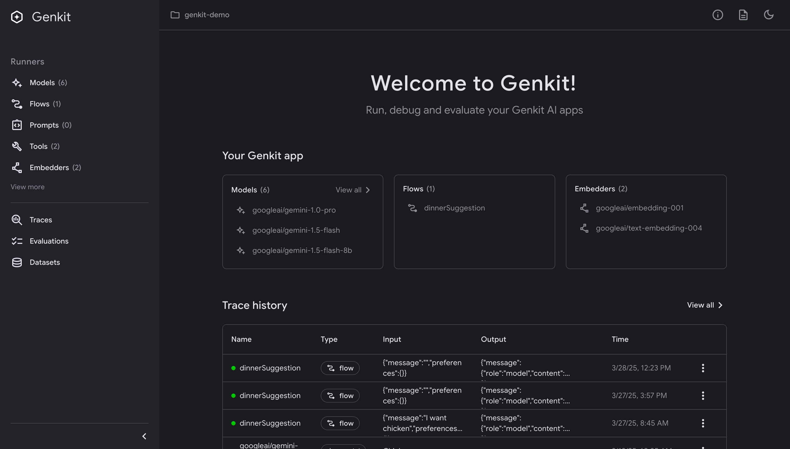

import { Tabs, TabItem } from "@astrojs/starlight/components";
import { CardGrid } from '@astrojs/starlight/components';
import { Image } from 'astro:assets';
import genkitDevUi from '../../assets/genkit.png';      
import InfoCard from '../../components/InfoCard.astro';


<h1>Pavel was here!!!</h1>
<h3 class="text-center">Benefits of Genkit</h3>

<div class="not-content flex flex-row items-stretch h-[283px] gap-[28px] !my-[50px] max-sm:flex-col max-sm:h-auto">
  <InfoCard title="Unified model interface" learnMoreUrl="javascript:void(0);" learnMoreText='Learn about model support'>
    Gemini
  </InfoCard>
  <InfoCard title="Building blocks for common AI use cases" learnMoreUrl="javascript:void(0);" learnMoreText='Learn the core concepts'>
    Powerful primitives to help you build agents, chatbots, and data-enhanced AI workflwos
  </InfoCard>
  <InfoCard title="Ready for web and mobile" learnMoreUrl="javascript:void(0);" learnMoreText='Learn about deployment'>
    Genkit is designed for server-side deployment with client-side helpers for seamless integration.
  </InfoCard>
</div>

<div class="not-content !my-[160px]">
  <Tabs>
  <TabItem label="Gemini">
  ```ts
  import { genkit } from 'genkit';
  import { googleAI, gemini20Flash } from '@genkit-ai/googleai';

  const ai = genkit({ plugins: [googleAI()] });

  const { text } = await ai.generate({
      model: gemini20Flash,
      prompt: 'Why is Firebase awesome?'
  });
  ```
  </TabItem>
  <TabItem label="Imagen">
  ```ts
  import { genkit } from 'genkit';
  import { vertexAI, Imagen3 } from '@genkit-ai/vertexai';

  const ai = genkit({ plugins: [vertexAI()] });

  const response = await ai.generate({
    model: imagen3,
    output: { format: 'media' },
    prompt: 'a banana riding a bicycle',
  });
  return response.media();
  ```
  </TabItem>
  <TabItem label="OpenAI">
  ```javascript
  import { genkit } from 'genkit';
  import { openAI, gpt4o } from 'genkitx-openai';

  const ai = genkit({ plugins: [openAI()] });

  const { text } = await ai.generate({
      model: gpt4o,
      prompt: 'Why is Firebase awesome?'
  });
  ```
  </TabItem>
  <TabItem label="Anthropic">
  ```ts
  import { genkit } from 'genkit';
  import { anthropic, claude35Sonnet } from 'genkitx-anthropic';

  const ai = genkit({ plugins: [anthropic()] });

  const { text } = await ai.generate({
      model: claude35Sonnet,
      prompt: 'Why is Firebase awesome?'
  });
  ```
  </TabItem>
  <TabItem label="Llama">
  ```ts
  import { genkit } from 'genkit';
  import { llama31, vertexAIModelGarden } from '@genkit-ai/vertexai/modelgarden';

  const ai = genkit({
    plugins: [
      vertexAIModelGarden({
        location: 'us-central1',
        models: [llama31],
      }),
    ],
  });

  const { text } = await ai.generate({
    model: llama31,
    prompt: 'Why is Firebase awesome?',
  });
  ```
  </TabItem>
  <TabItem label="Mistral">
  ```ts
  import { genkit } from 'genkit';
  import { mistralLarge, vertexAIModelGarden } from '@genkit-ai/vertexai/modelgarden';

  const ai = genkit({
    plugins: [
      vertexAIModelGarden({
        location: 'us-central1',
        models: [mistralLarge],
      }),
    ],
  });

  const { text } = await ai.generate({
    model: mistralLarge,
    prompt: 'Why is Firebase awesome?',
  });
  ```
  </TabItem>
  <TabItem label="Ollama">
  ```ts
  import { genkit } from 'genkit';
  import { ollama } from 'genkitx-ollama';

  const ai = genkit({
    plugins: [
      ollama({ models: [{ name: 'gemma' }] })
    ]
  });

  const { text } = await ai.generate({
    model: 'ollama/gemma',
    prompt: 'Why is Firebase awesome?',
  });
  ```
  </TabItem>
  </Tabs>
</div>


<h3 style="text-align: center;">Built-in developer tools</h3>
<h5 style="text-align: center; color:  var(--sl-color-gray-3); font-weight: 400;
">Run, debug and observe your AI workflows from the local Developer UI.</h5>

{/*  */}

<Image src={genkitDevUi} alt="Genkit Developer UI" />

<p style="margin-top: 40px;" class="text-gray-400 text-center" set:html="Accelerate AI development with a purpose-built, local CLI and Developer UI. Test prompts and flows against individual inputs or datasets, compare outputs from different models, debug with detailed execution traces, and use immediate visual feedback to iterate rapidly on prompts.">
</p>

<h3 style="text-align: center;">Learn Genkit</h3>
<h5 style="text-align: center; color:  var(--sl-color-gray-3); font-weight: 400;
">Run, debug and observe your AI workflows from the local Developer UI.</h5>

<div class="not-content flex flex-row items-stretch gap-[28px] max-sm:flex-col max-sm:h-auto" style="margin: 50px 0">
  <InfoCard title="Genkit by Example" learnMoreUrl="javascript:void(0);" learnMoreText='View Interactive Genkit code samples'>
  </InfoCard>
  <InfoCard title="Sample apps" learnMoreUrl="javascript:void(0);" learnMoreText='Learn the core concepts'>
  </InfoCard>
  <InfoCard title="?????" learnMoreUrl="javascript:void(0);" learnMoreText='Learn about deployment'>
  </InfoCard>
</div>
